# X-Route: Agente planificador de rutas (CDMX norte-centro)

## Estructura
- `src/`       módulos de Python (fase1.py, fase2.py, fase3.py)
- `notebooks/` notebook `xroute.ipynb` que importa `src/` y muestra todas las tablas y gráficas
- `tests/`     pruebas unitarias con pytest
- `data/`      grafo descargado y datos

## Instalación (Windows, PowerShell)
```
py -m venv .venv
.venv\Scripts\Activate.ps1
pip install -r requirements.txt
```

## Ejecución (siempre desde la carpeta raíz del proyecto)
```
python src/descargar_grafo.py   # Paso 1: descarga el mapa (solo una vez)
python src/mapa.py              # resumen del grafo y de los lugares elegidos
python src/fase1.py             # tabla BFS/DFS/UCS + verificación de accesibilidad
python src/snapshots_fase1.py   # imágenes de la frontera en imagenes/
python src/fase2.py             # tabla UCS vs A* (h1, h2, h3) vs Greedy
python src/admisibilidad.py     # validación empírica de admisibilidad
python src/mapas_fase2.py       # mapas interactivos A* vs Greedy en mapas/
python src/fase3.py             # entregas, matriz de distancias, SA y AG (5 corridas c/u)
python src/graficas_fase3.py    # convergencia SA/AG y experimento de T0 en imagenes/
python src/ruta_entregas_fase3.py  # mapa del recorrido: orden 1..15 vs orden de SA
```

O todo junto en un notebook (importa los módulos de `src/`, tarda ~20 s):
```
jupyter notebook notebooks/xroute.ipynb
```

## Pruebas
```
pytest -v
```
`pytest.ini` agrega `src/` al path, así las pruebas importan los módulos directamente.

## Resultados (imágenes)

### Espacio de estados
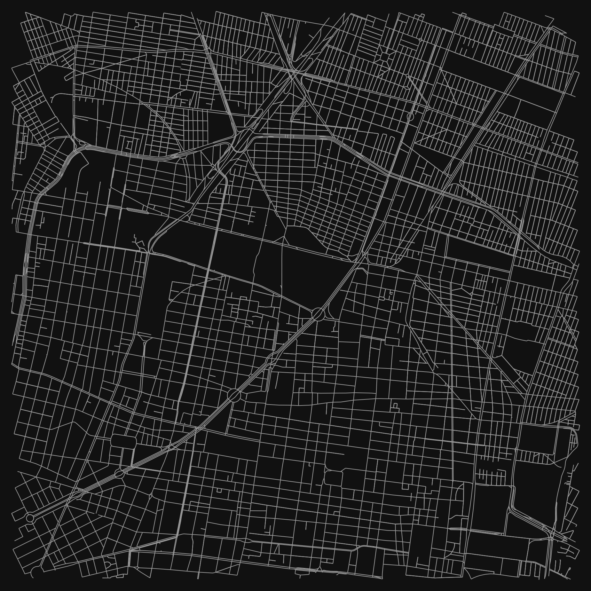

### Fase 1: búsqueda a ciegas
Tabla de BFS, DFS y UCS desde el depósito a los 6 lugares:

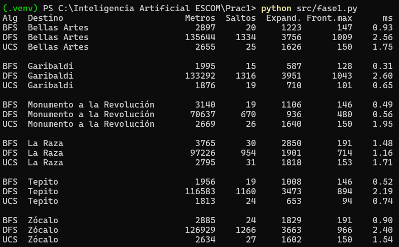

Avance de la frontera hacia La Raza (25%, 50% y 100%):

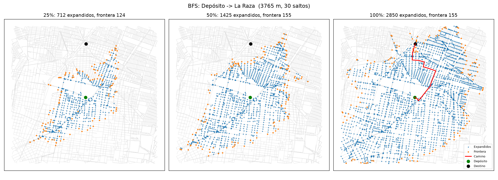
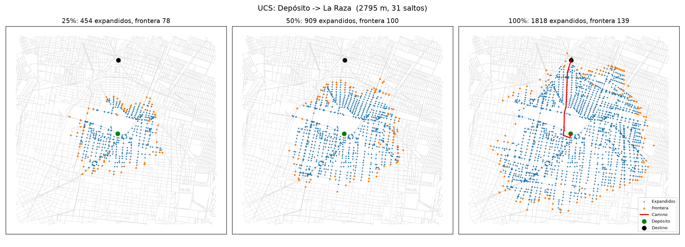
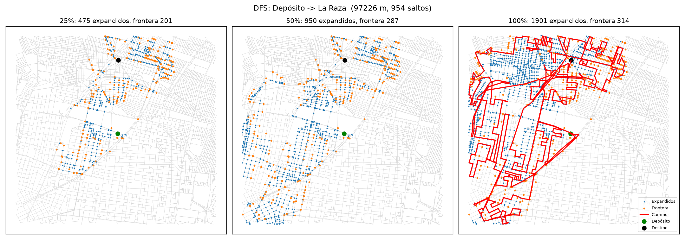

### Fase 2: búsqueda informada
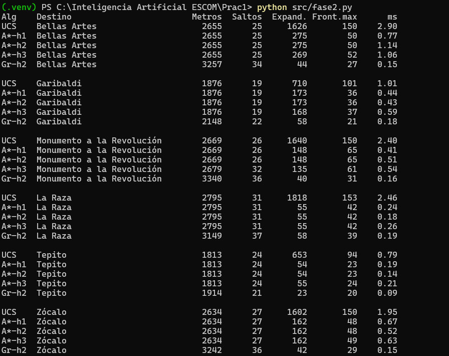
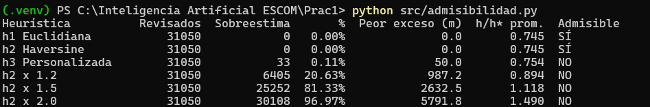

A* (azul) contra Greedy (rojo), Monumento a la Revolución:

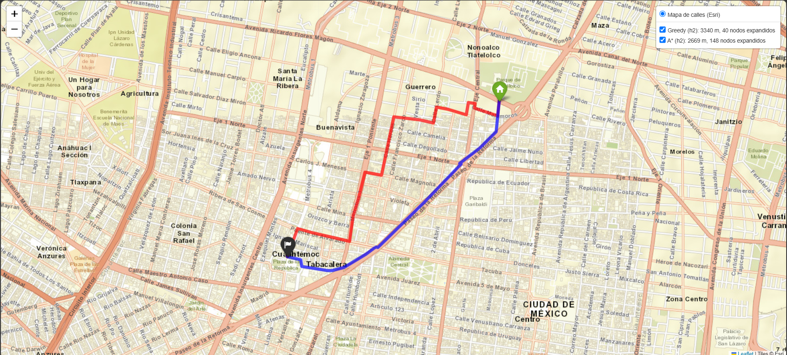

Otros pares: [Zócalo](imagenes/mapa_zocalo.png) · [Tepito](imagenes/mapa_tepito.png) · [Bellas Artes](imagenes/mapa_bellas_artes.png) · [Garibaldi](imagenes/mapa_garibaldi.png) · [La Raza](imagenes/mapa_la_raza.png)

### Fase 3: búsqueda local
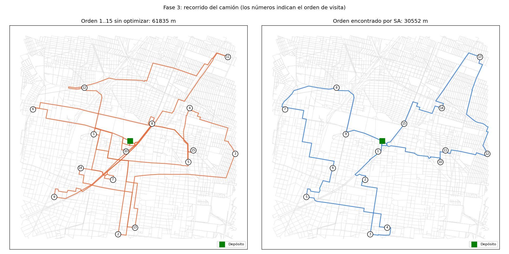
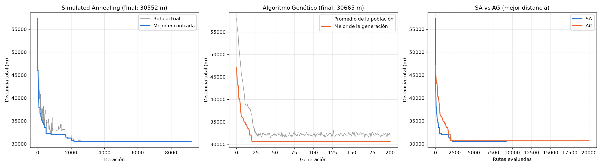
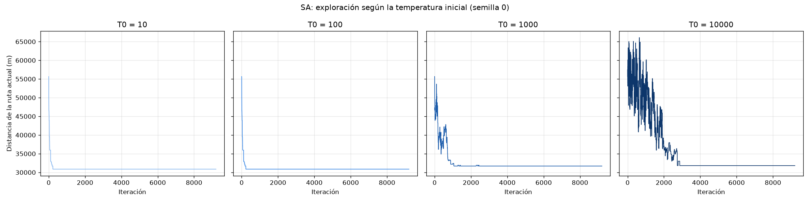

### Pruebas
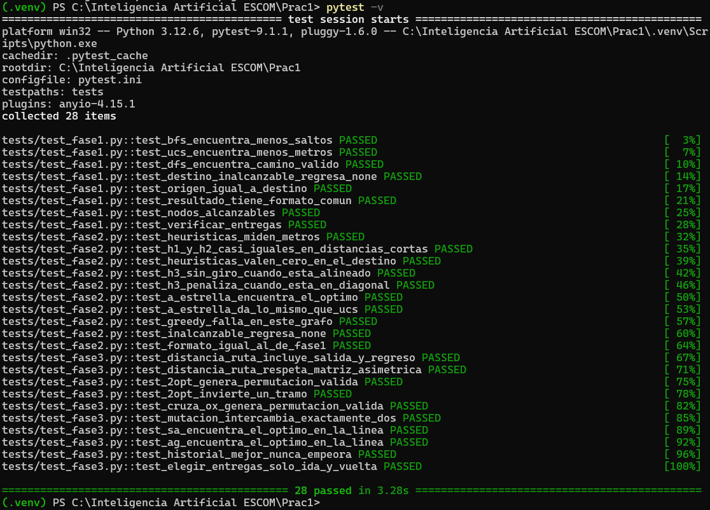

## Reporte
El reporte técnico completo está en 


